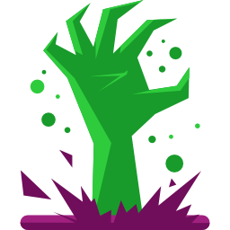

  

# FAF Zombies

Zombies mod for Forged Alliance Forever!

## What is this?

An enhanced version of the old Zombies mod created by Zarechaun. 

**Mechanics**

A player slot is designated as the "Zombie". Any units that die in game respawn as zombies for this player, I'll refer to this as zombification.

Zombie players units are NOT zombified by default. They must be killed first. This is a mechanics change I plan on removing in the future once more Zombie buffs/debuffs exist to make for more dynamic games.

## Lobby Options

Due to modding limitations, lobby options are found under the "AI Options" for the lobby.

### Player Slot

You can select the player slot for the Zombie. This will designate that player as the Zombie for the entirely of the game. 

### Vampire

This is built-in mass & energy vampire. When you kill a unit a percentage of that units mass/energy cost is added to your currently stored mass & energy. Say you have vampire set to 50%, this means you receieve 50% the mass/energy cost of what you kill.

Vampire currently applies to both normal players, and the zombie.

**Options**:

* 0% *(Default)*
* 25%
* 50%
* 100%
* 125%
* 150%
* 175%
* 200%

### Zombie Speed

This changes the movement speed of zombified units. 

**Options**:
* Very Slow: 50% Speed
* Slow: 75% Speed
* Normal: Normal Speed *(Default)*
* Fast: 125% Speed
* Very Fast: 150% Speed

### Zombie Decay

This lets you set a decay rate for zombified units. This causes the units (and buildings) to take damage over time as they "decay". The goal of this is to force the zombie player to be agressive and offensive, and to not horde mass amounts of units.

**Options**:

* None : No Decay *(Default)*
* Dynamic: Zombies decay logarithmicly, starts at normal decay speeds
* Very Slow: Decay within 12 minutes
* Slow: Decay within 8 minutes
* Normal: Decay within 5 minutes
* Fast: Decay within 3 minutes
* Very Fast: Decay within 1 minutes

**Notes:**

* Regen or repair extneds the lifespan of units with time-based decay
* Dynamic decay, in practice, will not kill units as the decay rate decreases as the units health decreases.
* This only applies to zombified units. The zombie plyers untis are NOT zombified by defualt, they have to be killed once to become zombies. This is likely to change in the future.

## What's Different?

* Lobby Options
  * Energy/Mass Vampire Options
  * Zombie slot selection
  * Zombie movement speed selection
  * Zombie unit decay selection
* Zombie slot unit death changes
  * Ctrl+K units no longer become zombies
* Welcome message
* Left info slideout (WIP, empty right now)

### Zombie slot unit death changes

Zombie player units no longer completely die and respawn from where the wreck is. This was the cause of some weirdness such as naval units not coming back till they sunk, and air units spawning on the ground. This also caused some grief to players as move/attack orders would be lost.

This has been changed so Zombie player units, on first death, show an explosion, but keep attacking/moving immediately. Vampire mass/energy and veterancy is handed out appropriately.

This also means that Zombue players fotresses don't fall twice, and chickens don't produce two lightning storms.

## Planned Features

* Mass/Energy Vampire Stats in slideout
* Zombies killed stats in sidebar
* **Balance**
  * Zombie player only Vampire option
  * Prevent some experimentals owned by the Zombie player from respawning after death (other players experimentals still become zombies)?
  * Option to turn off Zombie players zombies? Meaning the Zombie players units are already zombies, so they don't respawn fter death.
* Random Zombie assignment game mode (like phantom)
* ~Zombie unit health decay~
* Some sort of buffs/nerfs to Zombies/Normies to make the game more dynamic
  * ~Zombie Speed~
  * ~Zombie Decay~
  * Zombie Build Speed
* Cheese Mode (Fractal Zombies)
  * Experimentals should split into 1/2 mass equivilant T3 units of their kind
    * CZAR -> Restorers
    * Megolith -> 2x monkeylords
    * Fatboy -> Demolishers
    * ....etc

## Credits

Icon credit goes to Roundicons from www.flaticon.com

